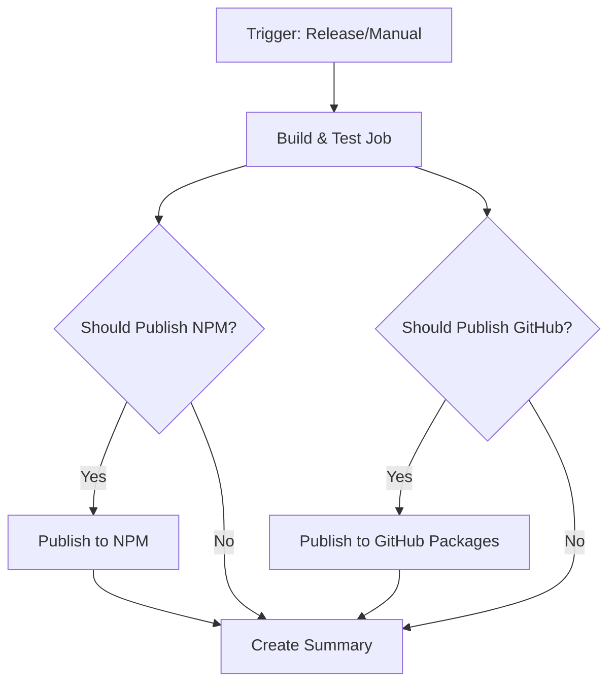

# GitHub Workflow Comparison and Unification

## Overview
This document compares the existing publish workflows and explains the unified `npm-github-publish.yml` workflow.

## Existing Workflows Comparison

### `npm-publish.yml` (Legacy)
**Strengths:**
- Simple, straightforward structure
- Publishes to both NPM and GitHub Packages
- Separate build/test validation step

**Weaknesses:**
- Uses outdated Node.js version (14 for tests)
- No manual trigger option
- No version validation or verification
- No NPM provenance for security
- No environment protection
- Limited error handling

### `publish-npm.yml` (Modern)
**Strengths:**
- Modern Node.js 18 with npm caching
- Manual workflow dispatch option
- NPM provenance for supply chain security
- Comprehensive verification steps
- Environment protection
- Version validation and conflict checking
- Rich summary output

**Weaknesses:**
- Only publishes to NPM (no GitHub Packages)
- More complex for simple use cases

## Unified `npm-github-publish.yml` Workflow

### Key Features

1. **Dual Registry Support**
   - Publishes to both NPM and GitHub Packages
   - Configurable via manual trigger inputs
   - Parallel publishing jobs for efficiency

2. **Comprehensive Build & Test**
   - Runs linting, tests, and builds
   - Validates package contents before publishing
   - Caches dependencies for faster execution

3. **Flexible Triggers**
   - Automatic on release publication
   - Manual dispatch with options to control:
     - Which tag/version to publish
     - Whether to publish to NPM
     - Whether to publish to GitHub Packages

4. **Security & Best Practices**
   - NPM provenance for supply chain security
   - Environment protection for production
   - Proper permissions management
   - Version conflict detection

5. **Verification & Reporting**
   - Post-publish verification
   - Comprehensive summary with installation instructions
   - Artifact upload/download for build consistency

6. **GitHub Packages Integration**
   - Proper scoping for GitHub registry
   - Automatic package.json modification for GitHub
   - Restoration of original package.json

### Workflow Structure



### Jobs Breakdown

1. **build-and-test**
   - Validates code quality (lint, test, build)
   - Extracts version information
   - Determines publish targets
   - Creates build artifacts

2. **publish-npm** (conditional)
   - Uses NPM registry configuration
   - Checks for version conflicts
   - Publishes with provenance
   - Verifies publication success

3. **publish-github** (conditional)
   - Uses GitHub Packages registry
   - Modifies package name for scoping
   - Publishes to GitHub registry
   - Restores original configuration

4. **create-summary**
   - Generates comprehensive publication report
   - Shows success/failure status for each registry
   - Provides installation instructions
   - Includes build metadata

### Configuration Requirements

**Secrets needed:**
- `NPM_TOKEN`: For NPM registry authentication
- `GITHUB_TOKEN`: Automatically provided for GitHub Packages

**Environment:**
- Production environment recommended for release protection

### Usage Examples

**Automatic (on release):**
- Both NPM and GitHub Packages will be published

**Manual dispatch:**
```yaml
# Publish only to NPM
tag: "v5.0.1"
npm_publish: true
github_publish: false

# Publish only to GitHub Packages
tag: "v5.0.1"
npm_publish: false
github_publish: true

# Publish to both (default)
tag: "v5.0.1"
npm_publish: true
github_publish: true
```

## Migration Recommendations

1. **Replace existing workflows**: The unified workflow replaces both `npm-publish.yml` and `publish-npm.yml`

2. **Test thoroughly**: Use manual dispatch with test versions before production releases

3. **Update documentation**: Reference the new workflow in README and contribution guidelines

4. **Configure environment protection**: Set up branch protection rules for the production environment

5. **Monitor first runs**: Watch the workflow execution closely during initial deployments

## Benefits of Unification

- **Reduced maintenance**: Single workflow to maintain instead of two
- **Consistency**: Same validation and build process for both registries
- **Flexibility**: Can publish to either or both registries as needed
- **Modern practices**: Incorporates latest GitHub Actions and NPM security features
- **Better visibility**: Comprehensive reporting and status tracking